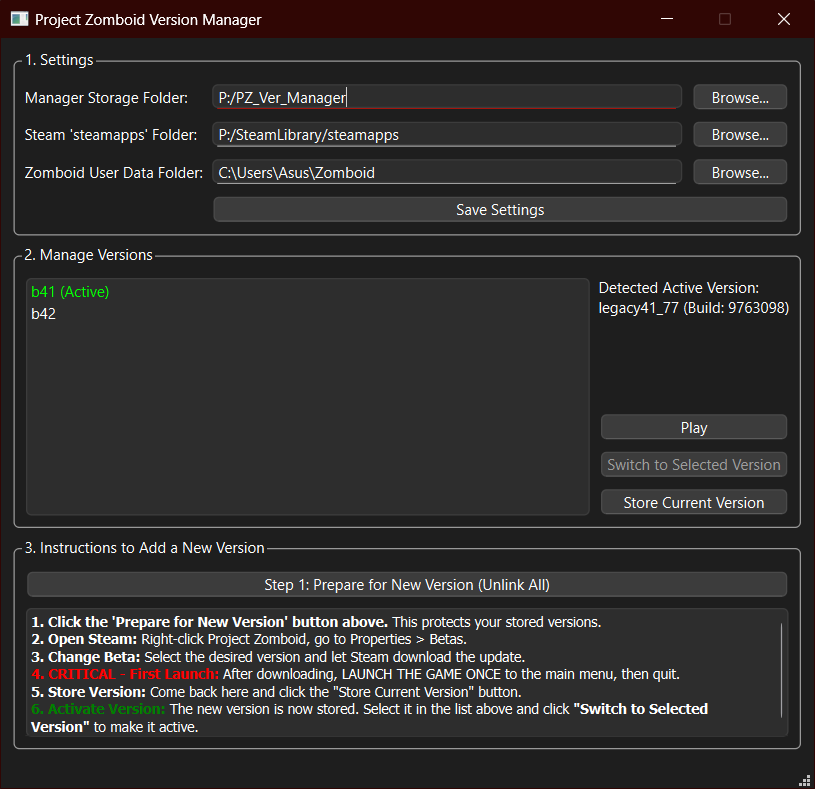

# Spiffo's Save-Swapper: The Project Zomboid Version Manager

<p align="center">
  <!-- NEED TO MAKE MY FANART NOW AAAAAAA rem:(200px wide.) -->
  
</p>

<p align="center">
  <strong>"This is how you died... from reinstalling the game to play with your friends."</strong>
</p>

<p align="center">
  
  
  
</p>

---

## What is This?

Welcome, survivor. This is a standalone application born out of pure frustration. It's a Project Zomboid Version Manager designed to let you switch between different game builds (like stable **Build 41** for multiplayer and the beta **Build 42**) without wanting to test the structural integrity of your monitor with a nearby hammer.

It works by using the dark magic of **symbolic links** to keep separate, isolated copies of each version you want to play. When you switch, it just swaps which copy Steam is looking at. The result is near-instant switching with zero risk of save file corruption.

## Key Features

-   **Total Version Isolation:** Keeps your game files, saves, mods, and settings for each build completely separate.
-   **Near-Instant Switching:** Swapping between massive game installs takes less than a second.
-   **User-Guided Workflow:** You are in control. The app tells you how to download new versions safely without Steam overwriting your precious backups.
-   **One-Click Play Button:** Launch the currently active version directly through Steam.
-   **An Eternal Progress Bar:** A feature that doesn't show you progress, but instead teaches you the valuable survival skill of patience.

---


## Screenshot


---

## Installation & How to Run

1.  **Go to the [Releases Page](https://github.com/MasterKraid/pz_version_manager/releases)** on the right-hand side of this repository.
2.  Download the latest `PZVersionManager.exe` file.
3.  Place the `.exe` anywhere you like. It's self-contained.
4.  **Run as Administrator.** This is not a suggestion. Right-click the `.exe` and select "Run as administrator". The app needs these privileges to create symbolic links.

---

## Step-by-Step Guide

#### 1. First-Time Setup
-   Run the app (as an administrator).
-   Click **`Browse...`** and create a new, empty **Manager Storage Folder** on a drive with plenty of space (e.g., `D:\PZ_Manager`). This is where your game files will live.
-   Important: Verify the `steamapps` and `Zomboid User Data` folders are correct.
-   Click **`Save Settings`**.

#### 2. Storing Your Current Version (e.g., Build 41)
-   With Build 41 installed through Steam, click **`Store Current Version`**.
-   Give it a name (e.g., `b41-stable`) and click OK. The app will copy your game files. Go make some tea.
-   The version will appear in the list.

#### 3. Adding a New Version (e.g., Build 42)
1.  **Prepare:** Do this step if and only if the `Active` icon shows in the list beside a version. That means one of the versions is already linked, if not skip this step, i.e. if nothing is shown as active...
 Click the **`Step 1: Prepare for New Version (Unlink All)`** button. This is a critical safety step that protects your stored versions from being overwritten by Steam.
2.  **Download:** Go into Steam's properties for Project Zomboid, switch to the `unstable` beta branch, and let it finish downloading.
3.  **Launch Once:** **CRITICAL!** After the download, launch the game once to the main menu, then quit. This generates the necessary user files.
4.  **Store:** Return to the app and click **`Store Current Version`**. Give it a name like `b42-beta`.
5.  **Activate:** The new version is now stored. To use it, select it in the list and click **`Switch to Selected Version`**.

---

## For Developers who wish to contribute:

<details>
  <summary>Click to expand developer instructions</summary>
  
  #### Prerequisites
  - [Python](https://www.python.org/downloads/) (3.9+)
  - [Git](https://git-scm.com/downloads)

  #### Setup
  1. **Clone the repository:**
     ```bash
     git clone https://github.com/your-username/pz-version-manager.git
     cd pz-version-manager
     ```
  2. **Create and activate a virtual environment:**
     ```bash
     python -m venv venv
     # On Windows:
     .\venv\Scripts\activate
     ```
  3. **Install dependencies:**
     ```bash
     pip install -r requirements.txt
     ```
  4. **Run the application:**
     ```bash
     python main.py
     ```
  5. **Package into an executable (optional):**
     - Install PyInstaller: `pip install pyinstaller`
     - Run the build command:
       ```bash
       pyinstaller --onefile --windowed --name PZVersionManager main.py
       ```
     - Find the final `.exe` in the `dist/` folder.
</details>

---

## Directory Structure

```pz_version_manager/
│
├── core/
│   ├── manager.py          # The brain of the operation.
│   ├── utils.py            # The janitor. Finds paths and checks permissions.
│   └── worker.py           # The heavy lifter. Copies files and stuff.
│
├── ui/
│   └── main_window.ui      # The pretty face (an XML file).
│
├── main.py                 # The heart. Runs the whole show.
└── requirements.txt        # The shopping list for Python.
```

---

## Frequently Asked Questions

**Q: Why do I *really* need to run this as an administrator?**
**A:** Because Windows doesn't trust just anyone to create symbolic links, which is the magic that makes this app work. No admin rights, no magic.

**Q: The app threw an error about "mklink"! Is my game gone?!**
**A:** No, calm down. Your game is safe in the Manager Storage Folder. This error almost always means you forgot to run the app as an administrator. Close the app, run it as admin, and use the "Switch to Selected Version" button to try linking again.

---
## Known Issues:
1.	Auto Select is currently disabled because of my lack of braincells.
2.	The ProgressBar really doesn't show any progress.
3.	 Clicking on **`Step 1: Prepare for New Version (Unlink All)`** deletes the game if haven't already been copied. My bad... I am still figuring how to make the logic better. 
4.	ADD MORE ISSUES